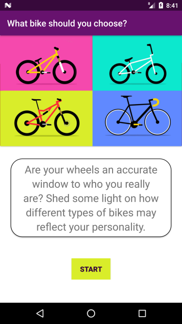
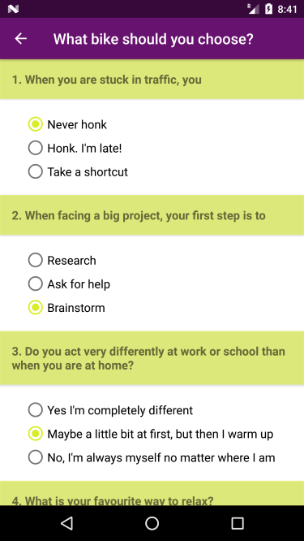
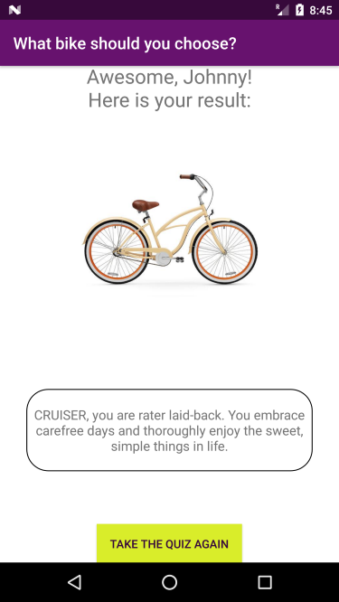

# ABND | Quiz App
This quiz lets you find out what type of bike matches best with your personality. It's the third project completed for the Android Basics Nanodegree program offered by Udacity in collaboration with Google.

# Project Description
Implement an app to through which users can take a short personality quiz and find out what type of bicycles best matches it.

# Pre-requisites
-	Android SDK v22
-	Android Build Tools v22.0.1
-	Android Support Repository v22.1.1

# Learning objecives
This project is about combining various ideas and skills I’ve been practicing throughout the course. They include:

- Apply OOP techniques in building the app (classes, objects, methods, casting etc.)
- Adding interactivity through set boxes, submitting buttons and reading user input.
- Basic debugging and logging techniques.
- Change view content on the same activity.
- Planning your app design before coding.
- Taking an app layout from drawing to XML code.
- Creating, positioning, and styling views.
- Creating interactivity through button clicks and Java code.
- Commenting and documenting your code.
